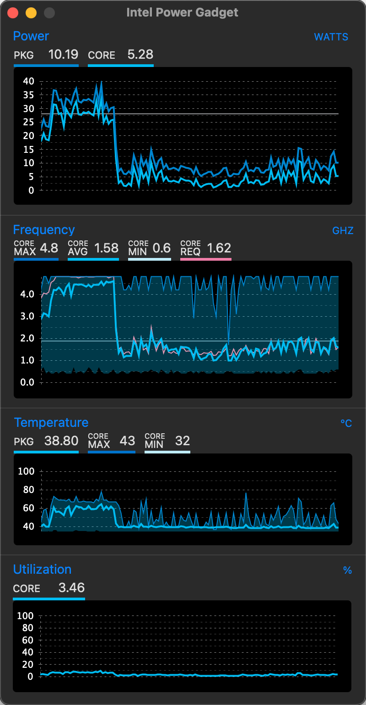

> 配置信息

CPU: q1j3. 等同i7 1360P

主板芯片组: inter B760M 

显卡： RX560

声卡：ALC 897

网卡：RTL 8111

固态：西数SN550 512

无线网卡: BCM94360CS2 


> 带解锁 CFG LOCK BIOS

biosMD5: 7bffec16046d2a3c16e5e9bc91f6ad2e

BIOS升级步骤：

1.将U盘格式化成FAT32分区，不要使用MSDOS或其他启动盘

2.将下载的BIOS压缩包解压到U盘根目录

3.将U盘插入需要升级BIOS的主板USB接口，拔掉所有SATA和M.2存储设备

4.按下电源按钮，稍等片刻。 主板会进入UEFI shell界面，自动升级BIOS

5.等待1-3分钟，当界面出现绿字提示Success时，此时可以关机

6.升级BIOS后，建议关闭主板交流电源，清除主板CMOS信息，然后按delete键进入BIOS，按F9加载优化值，按F10 保存并重新启动。

7.升级完成


升级时要用单独U盘或者固态EFI分区都可以。其他设备要移除！！！

升级时要用单独U盘或者固态EFI分区都可以。其他设备要移除！！！

升级时要用单独U盘或者固态EFI分区都可以。其他设备要移除！！！

上述是建议，也可以用命令直接刷。


找不到对应的文件可以用下面命令

附： EFI升级脚本命令

```
Fpt.efi -F erying827.bin
```


升级出错不要找我！！


> BIOS设置

bios设置:

Hyperthreading 关闭超线程(关键)

resize  bar 关闭

cfg lock关闭(需要bios解锁选项，GitHub提供刷)

serial port  关闭

quiet boot 关闭

csm开启:  启动项仅uefi 显卡uefi 


> 测试

显卡驱动正常，支持硬件解码


网卡: 有线网卡正常 无线正常

蓝牙: 正常，隔空投送正常

CPU变频：正常




USB: 已定制端口


睡眠测试正常
